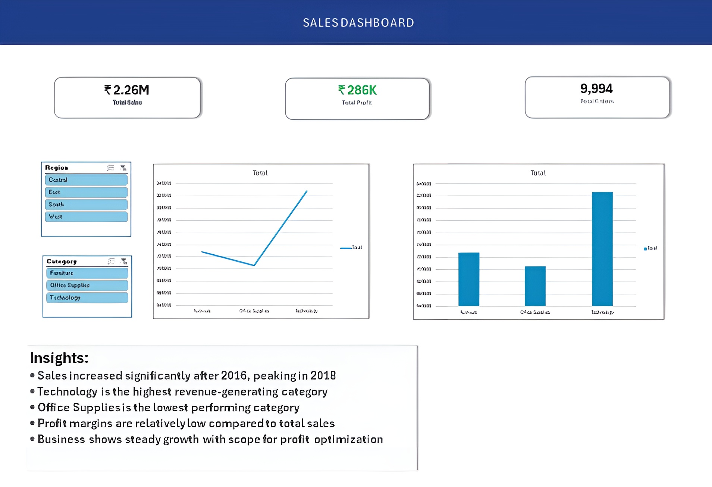

# SCT_DA_1
# 📊 Sales Dashboard (Excel)

## 📌 Objective
Analyze sales data and create an interactive dashboard using Excel.

## 🛠 Tools Used
- Microsoft Excel
- Pivot Tables
- Charts
- Slicers

## 📊 Features
- KPI Cards (Total Sales, Profit, Orders)
- Sales Trend Analysis
- Category-wise Performance
- Interactive Filters (Region, Category)

## 🧠 Key Insights
- Sales declined slightly in 2016 but showed strong growth afterward
- Technology is the highest-performing category
- Office Supplies is the lowest-performing category
- Profit margins are relatively low compared to total sales

## 📷 Dashboard Preview

